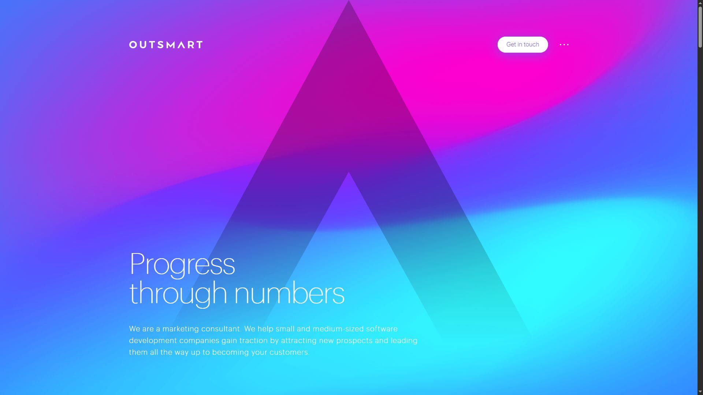

# Проект "Outsmart" – Адаптивный лендинг с портфолио и формой обратной связи

## О проекте

Одностраничный адаптивный сайт для digital-компании **Outsmart**, включающий блоки с кейсами, логотипами клиентов и формой обратной связи. Сайт разработан с акцентом на производительность, адаптивность и визуальную презентацию успешных проектов.

Цель — подчеркнуть экспертность компании, продемонстрировать результаты и упростить первый контакт с потенциальными клиентами.

## Превью проекта



## Ссылка на демо

- [Посмотреть сайт](https://outsmart-green.vercel.app/)

## Статус проекта

✅ Проект завершён

## Функциональность

- 📌 Блок **портфолио** с реальными кейсами и KPI
- 🤝 Блок **клиенты** с логотипами компаний
- 💬 **Форма обратной связи** с авторасширением textarea
- 🔄 **Кнопка "Load more"** для кейсов
- 🔢 **Пагинация** в списке клиентов
- 📱 **Адаптивная вёрстка** под разные устройства

## Технологии и инструменты

- **HTML5** — семантическая структура
- **CSS3** — стилизация, анимации, медиазапросы
- **Flexbox / CSS Grid** — отзывчивая сетка
- **JavaScript (ES6+)** — динамическое поведение
- **Методология БЭМ** — читаемый и масштабируемый код
- **Modernizr** — проверка поддержки WebP
- **Autosize.js** — автоувеличение поля ввода
- **Yarn** — управление зависимостями и сборка

## Требования

- Верстка по [БЭМ](https://ru.bem.info/)
- Организация файлов по [Nested БЭМ](https://ru.bem.info/methodology/filestructure/#nested)
- Валидность кода по [W3C](https://validator.w3.org/)
- Соответствие [требованиям к коммит сообщениям](https://www.freecodecamp.org/news/writing-good-commit-messages-a-practical-guide/)

## Полезные ссылки

- [Дизайн макет в Figma](https://www.figma.com/file/RpKABoy6gfL5g2QbDdgF2F/Outsmart?node-id=46%3A2)
- [Чеклист для самостоятельной проверки](https://code.s3.yandex.net/web-developer/checklists-pdf/web-plus/checklist-1.pdf)

## Установка и запуск

1. Клонировать репозиторий:

   ```bash
   git clone https://github.com/kirill-io/outsmart.git

   ```

2. Перейдите в директорию проекта:

   ```bash
   cd outsmart-landing

   ```

3. Установите зависимости:

   ```bash
   yarn

   ```

4. Запуск в режиме разработки:

   ```bash
   yarn dev

   ```

5. Сборка проекта:

   ```bash
   yarn build

   ```
